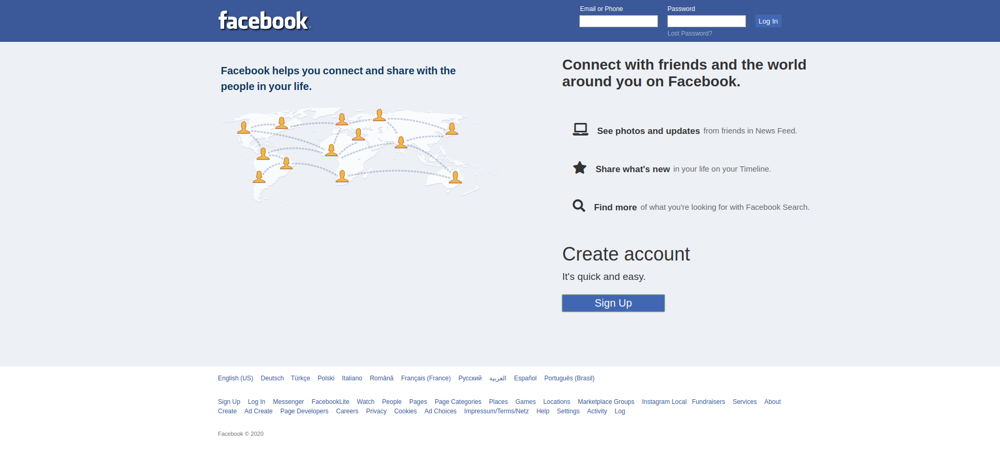

# Sign in Page

- A design log in page using manly grid and flexbox in additional! 
- This project was built during the Web development course.

> This project is for learning purposes only.

#### Previous of the first version

### TODO

- [ ] Code Optimization
- [ ] CSS and HTML semantic Tags
- [ ] Responsive Designer

